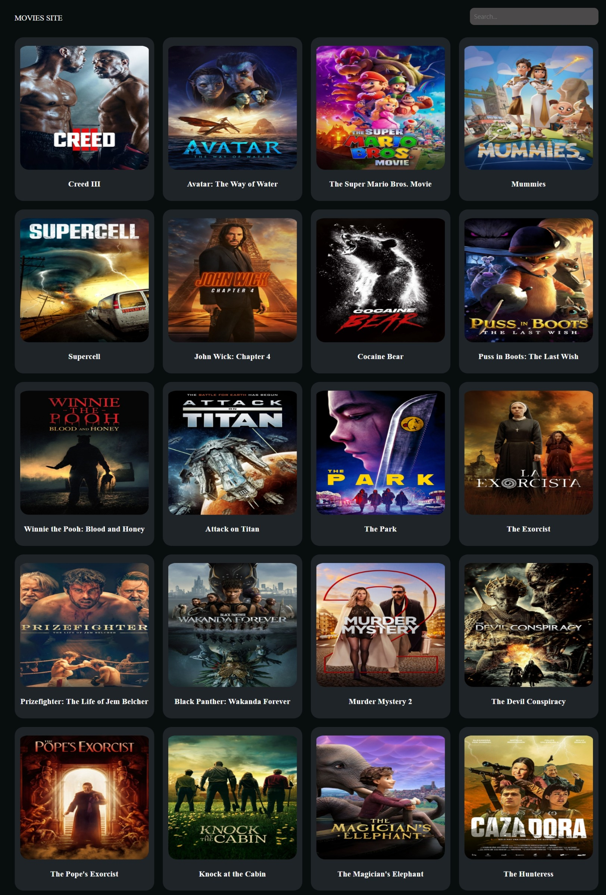

# Frontend Mentor - QR code component solution

This is a simple Movie Website project I took up to help me improve my coding skills by building realistic projects.
I integrated the website with a TMDB API key to output a list of movies and enable one to search for movies by title.

## Table of contents

- [Overview](#overview)
  - [Screenshot](#screenshot)
  - [Links](#links)
- [My process](#my-process)
  - [Built with](#built-with)
  - [Continued development](#continued-development)
- [Author](#author)

## Overview

### Screenshot

### Links

- Solution URL: [https://joykara.github.io/Movie-Site.git]
- Live URL: [https://joykara.github.io/Movie-Site/]

## My process

### Built with

- Semantic HTML5 markup
- CSS custom properties
- Javascript

### Continued development

The areas I want to continue focusing on in future projects include:
- Building more responsive sites, integrating them to work in desktops, tablets and on phone.
- Refining my code lines too.

## Author

- Website - [Joy Mwende Karani](https://joykara.github.io/Movie-Site.git)